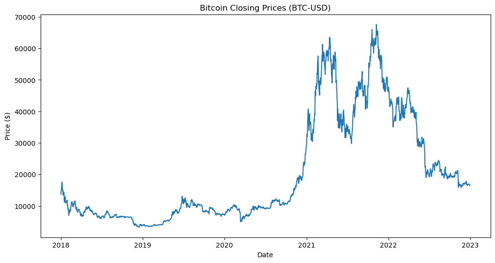
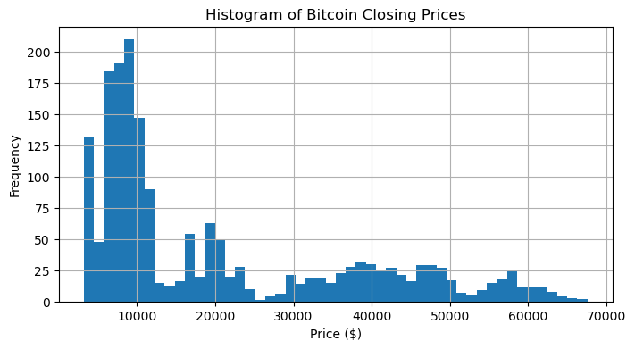
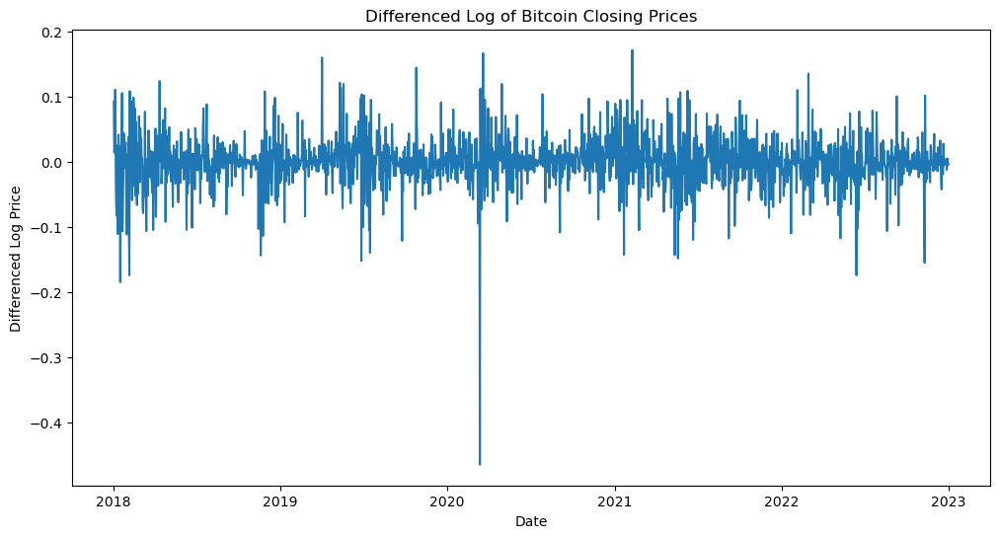
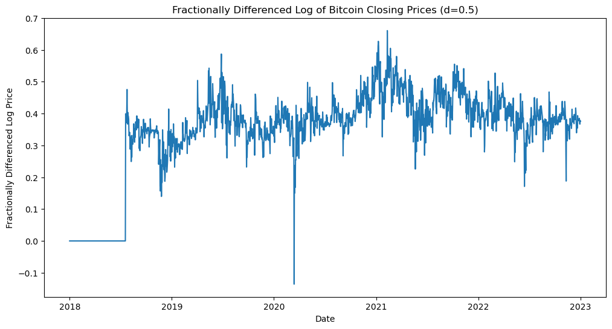
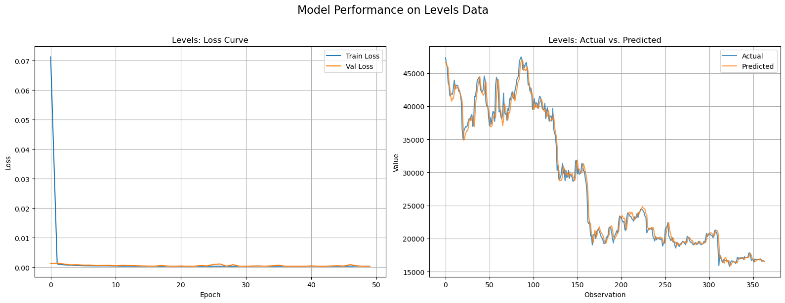
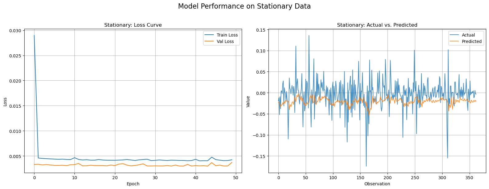
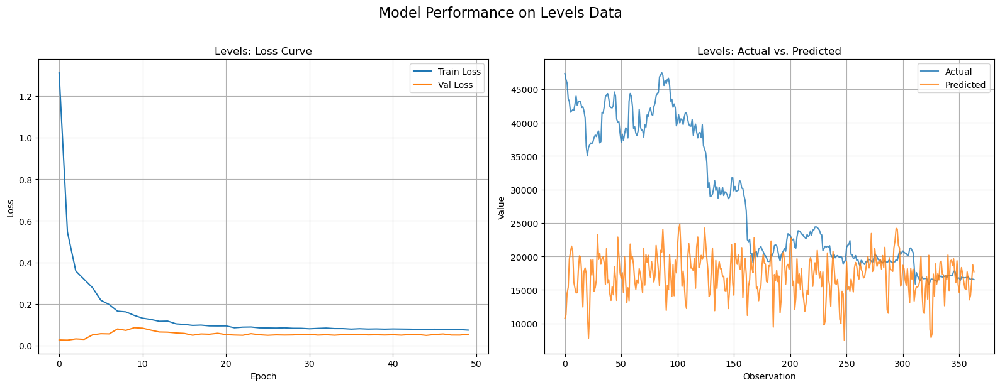
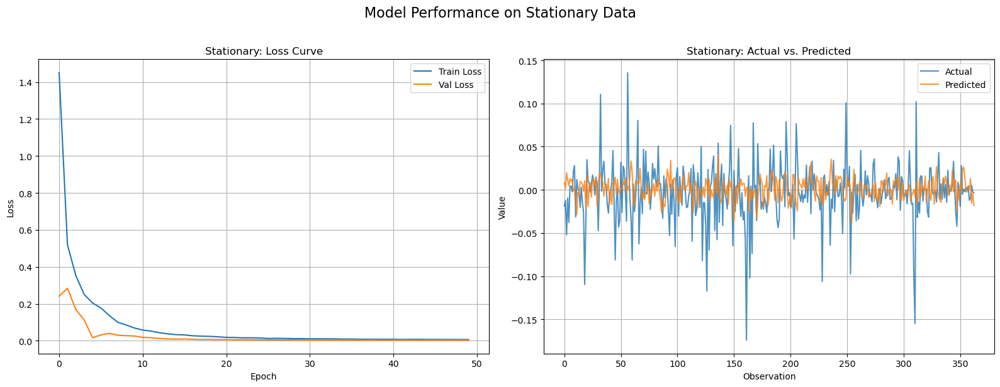
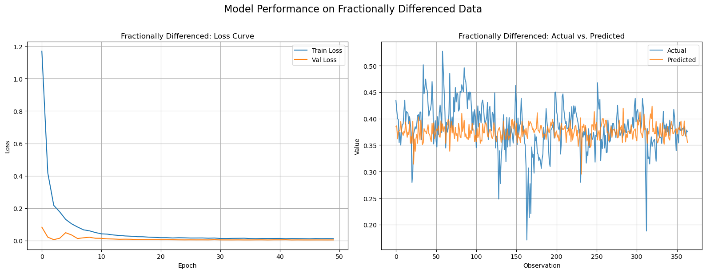

# **Predicting Bitcoin Prices: A Comparative Study of Neural Network Architectures**

## **1. Introduction**

Time series modeling is crucial for applications ranging from financial forecasting to predictive maintenance. In this analysis, we explore the performance of two prominent neural network architectures—Multi-Layer Perceptron (MLP) and Convolutional Neural Networks (CNN)—on Bitcoin closing price data. By leveraging three different preprocessing techniques (levels, stationary differencing, and fractional differencing), we aim to assess how each architecture adapts to the unique characteristics of the data and its temporal dependencies.

This report provides a detailed analysis of preprocessing, model architectures, performance metrics, and comparative strengths. Results are supported by visualizations to enable a deeper understanding of the model behaviors.

---

## **2. Data Collection and Initial Exploration**

Bitcoin's daily closing prices were downloaded from Yahoo Finance for the period 2018-01-01 to 2023-01-01. The dataset was limited to the most recent 2,000 observations for computational efficiency.

### **Raw Bitcoin Prices**
The raw closing prices are plotted in Figure 1 to visually analyze trends and volatility.

**Figure 1**: Bitcoin Closing Prices (BTC-USD)  

### **Summary Statistics**
The descriptive statistics are presented below:

| Metric | Value         |
|--------|---------------|
| Count  | 1826          |
| Mean   | $20,338.67    |
| Std. Dev. | $16,986.02 |
| Min    | $3,236.76     |
| 25%    | $7,682.07     |
| 50%    | $10,960.59    |
| 75%    | $33,740.26    |
| Max    | $67,566.83    |

Bitcoin's price shows a highly skewed distribution with periods of dramatic spikes and troughs.

---

## **3. Distribution Analysis**

The distribution of Bitcoin prices was visualized using a histogram, as shown in Figure 2.

**Figure 2**: Histogram of Bitcoin Closing Prices  

The histogram confirms a highly skewed distribution, with the majority of prices concentrated in lower ranges. This non-normal distribution necessitates transformations to stabilize variance and prepare data for modeling.

---

## **4. Stationarity Analysis**

##### **4.1 Augmented Dickey-Fuller (ADF) Test**
Stationarity is a critical assumption for many time series models. The Augmented Dickey-Fuller (ADF) test was applied:

- **ADF Statistic**: -1.37  
- **p-value**: 0.60  

Since the p-value is greater than 0.05, the null hypothesis (non-stationarity) cannot be rejected. This indicates that the raw price series is non-stationary.

### **4.2 Log Transformation and Differencing**
A log transformation was applied to stabilize variance, followed by first differencing to achieve stationarity. The transformed series is shown in Figure 3.

**Figure 3**: Differenced Log of Bitcoin Closing Prices  

The ADF test on the differenced log series yields:
- **ADF Statistic**: -29.67  
- **p-value**: 0.00  

The differenced series is stationary, with a p-value below 0.01.

---

## **5. Fractional Differencing**

To retain long-memory properties while achieving stationarity, fractional differencing was applied using \( d = 0.5 \). The resulting series is shown in Figure 4.

**Figure 4**: Fractionally Differenced Log of Bitcoin Closing Prices  

The ADF test on this series indicates:
- **ADF Statistic**: -3.12  
- **p-value**: 0.03  

This result confirms that fractional differencing effectively balances stationarity and data structure preservation.

---

## **6. Feature Engineering**

Lagged features were generated to capture temporal dependencies. A total of 10 lagged features were created for each series (raw, stationary, and fractionally differenced). These features form the basis for the supervised learning models discussed below.

---

## **7. Predictive Modeling**

### **7.1 Multi-Layer Perceptron (MLP)**
An MLP model was developed for regression tasks using lagged features. The architecture consisted of:
- Input layer: 10 features
- Hidden layers: 64 neurons and 32 neurons
- Output layer: Single neuron for price prediction
- Loss function: Mean Squared Error (MSE)

#### **Training and Evaluation**
The MLP model was trained for 50 epochs with a batch size of 32. The loss curve and predictions for each dataset (raw, stationary, fractionally differenced) are illustrated in Figures 5-7.

**Figure 5**: Model Performance on Levels Data  

**Figure 6**: Model Performance on Stationary Data  

**Figure 7**: Model Performance on Fractionally Differenced Data  

#### **Performance Metrics**
- **Raw Prices**: RMSE = 1076.48
- **Stationary Series**: RMSE = 0.0387
- **Fractionally Differenced Series**: RMSE = 0.0350

The MLP model performed best on the stationary and fractionally differenced series, highlighting the importance of preprocessing for stationarity.

---

### **7.2 Convolutional Neural Networks (CNNs)**
Gramian Angular Field (GAF) transformations were applied to convert time series data into images. CNNs were then trained on these images. The architecture included:
- Convolutional layers: 3 layers with 32-64 filters
- Fully connected layers: 128 neurons, followed by a regression output layer
- Loss function: Mean Squared Error (MSE)

#### **Training and Evaluation**
The CNN models were trained for 50 epochs. The loss curves and predictions for each dataset are shown in Figures 8-10.

**Figure 8**: CNN Performance on Levels Data  

**Figure 9**: CNN Performance on Stationary Data  

**Figure 10**: CNN Performance on Fractionally Differenced Data  

#### **Performance Metrics**
- **Raw Prices**: RMSE = 14,956.88
- **Stationary Series**: RMSE = 0.0362
- **Fractionally Differenced Series**: RMSE = 0.0488

CNNs excelled on stationary series, though they were computationally intensive compared to MLPs.

---

## **8. Comparison of CNN and MLP Architectures**

### **8.1 Introduction**
The results from evaluating CNN and MLP architectures on levels, stationary, and fractionally differenced data reveal key differences in their performance and ability to process time series data. These differences stem from the architectures' fundamental processing mechanisms and their compatibility with the unique properties of the datasets.

---

### **8.2 Performance Comparison**

| Dataset                  | MLP RMSE | CNN RMSE | Winner |
|--------------------------|-----------|-----------|--------|
| Levels Data              | 1076.48   | 14956.88  | MLP    |
| Stationary Data          | 0.0387    | 0.0362    | CNN    |
| Fractionally Differenced | 0.0350    | 0.0488    | MLP    |

1. **Levels Data**:
   - **MLP**: The MLP achieved an RMSE of **1076.48**, outperforming the CNN, which produced an RMSE of **14956.88**. The MLP's ability to handle levels data reflects its capacity to approximate complex mappings through fully connected layers that can learn global dependencies in the input features.
   - **CNN**: The CNN struggled significantly, as shown by its high RMSE. This can be attributed to the convolutional architecture's localized feature extraction, which is less suited for capturing global dependencies inherent in raw levels data.

   **Analysis**:
   - Levels data retains non-stationarity and high variability. The CNN, designed to extract spatial or temporal patterns locally, is ill-equipped to handle the broader trends and global correlations present in such data. In contrast, the MLP processes all input features as a unified whole, which helps it better adapt to the irregularity of the levels dataset.

2. **Stationary Data**:
   - **MLP**: The MLP performed well, achieving an RMSE of **0.0387**, demonstrating its capability to handle stationary data where trends and seasonality have been removed.
   - **CNN**: The CNN slightly outperformed the MLP with an RMSE of **0.0362**, indicating its ability to effectively capture local patterns in the stationary dataset.

   **Analysis**:
   - Stationary data presents a simpler modeling challenge since trends and large variations have been removed. The CNN's localized feature extraction aligns well with capturing the short-term dependencies present in stationary time series. The MLP also performs well due to its flexibility but lacks the CNN's structured approach to leveraging localized patterns.

3. **Fractionally Differenced Data**:
   - **MLP**: The MLP performed better with an RMSE of **0.0350** compared to the CNN's **0.0488**.
   - **CNN**: The CNN performed moderately but failed to fully capture the long-term dependencies preserved in fractionally differenced data.

   **Analysis**:
   - Fractionally differenced data retains a balance between long-term and short-term dependencies. While the CNN can extract localized features, it struggles with long-term dependencies due to its limited receptive field. The MLP, on the other hand, processes the entire feature space globally, allowing it to capture these dependencies more effectively.

---

### **8.3 Architectural Differences**

1. **MLP (Multi-Layer Perceptron)**:
   - MLPs are composed of fully connected layers, where each node in a layer is connected to all nodes in the subsequent layer. This design enables the MLP to learn global patterns from the input features.
   - **Strengths**:
     - Flexibility in approximating complex, non-linear relationships.
     - Effective at processing datasets with strong global dependencies, such as levels data.
   - **Weaknesses**:
     - Less efficient at capturing localized features or temporal structures compared to CNNs.
     - Prone to overfitting without proper regularization, particularly on high-dimensional data.

2. **CNN (Convolutional Neural Network)**:
   - CNNs use convolutional layers to extract localized features from input data. In time series analysis, CNNs excel at identifying short-term dependencies or localized temporal patterns.
   - **Strengths**:
     - Efficient in processing structured data like images or stationary time series with local patterns.
     - Built-in mechanisms for spatial and temporal pattern recognition.
   - **Weaknesses**:
     - Struggles with capturing global dependencies or trends in non-stationary data, such as levels data.
     - Limited receptive field, which can hinder performance on datasets requiring a global view.

---

### **8.4 Dataset Properties and Suitability**

1. **Levels Data**:
   - High variability and non-stationarity in levels data require a model that can adapt to large-scale trends and global dependencies.
   - The MLP's global processing mechanism is better suited for this, while the CNN's localized processing fails to capture broader patterns.

2. **Stationary Data**:
   - The removal of trends and seasonality makes stationary data easier to model. Both MLP and CNN perform well, but the CNN's localized feature extraction gives it a slight edge in this context.

3. **Fractionally Differenced Data**:
   - Fractionally differenced data retains some long-term dependencies while mitigating non-stationarity. The MLP's ability to process global patterns allows it to excel, whereas the CNN struggles with capturing these dependencies.

---

### **8.5 Recommendations**
1. For datasets with strong global dependencies or high non-stationarity (e.g., levels data), MLPs are the preferred choice due to their global processing capabilities.
2. For datasets with localized patterns or short-term dependencies (e.g., stationary data), CNNs are highly effective.
3. For fractionally differenced data or datasets with mixed dependencies, hybrid architectures combining CNN and MLP (e.g., CNN-LSTM or CNN-MLP) may provide better results.

---

### **8.6 Conclusion**
The observed differences in performance between CNN and MLP architectures highlight the importance of aligning the choice of model with the properties of the dataset. While CNNs are powerful tools for localized feature extraction, MLPs offer greater flexibility in capturing global dependencies, making them more suitable for complex time series with non-stationary characteristics. For applications involving mixed dependencies, hybrid or ensemble models may yield the best results.

---